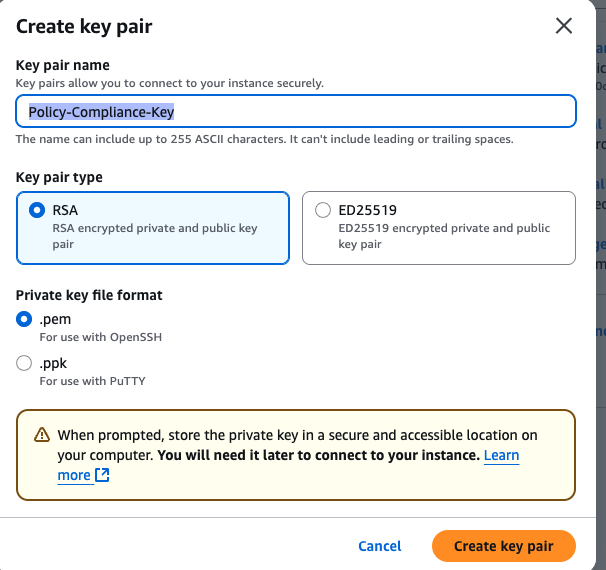

# AI_Powered_Policy_Compliance_System

# neo4j 
- neo4j start
- http://localhost:7474/browser/ (login)
- neo4j stop
# installing virtual env
```
python3.11 -m venv .venv
source .venv/bin/activate
```

## upgrade pip and install package
```
python -m pip install --upgrade pip setuptools wheel
pip install numpy
```

# requirement.txt
```
pip install -r requirements.txt
```

# Neo4j
- brew services start neo4j
- neo4j start
- neo4j status

# Creating virtual environment
```commandline
python -m venv .venv
source .venv/bin/activate
```

# pip install

pip install openai langchain langchain-openai neo4j fastapi uvicorn[standard] python-dotenv pydantic tiktoken spacy typer rich tqdm numpy scipy soundfile
python -m spacy download en_core_web_sm
pip install python-docx
pip install pypdf
pip install python-docx pypdf spacy neo4j python-dotenv openai
pip install python-docx neo4j python-dotenv openai numpy tiktoken
pip install typer
pip install typer rich click

python -m graph_rag_voice.cli ingest ./policies

# # Graph RAG + Voice Q&A (Neo4j, FAISS, LangChain, OpenAI)

Build once, run three ways: **CLI**, **FastAPI**, **Streamlit**.

## 1) Setup

```bash
python3 -m venv .venv
source .venv/bin/activate   # Windows: .venv\Scripts\Activate.ps1
pip install -r requirements.txt
python -m spacy download en_core_web_sm
cp .env.example .env  # add keys/URIs
pip install awscli
```

(Optional) start Neo4j in Docker:
```bash
docker compose up -d neo4j
```

# Neo4j connectior
<!-- https://console-preview.neo4j.io/projects/64be119e-9a78-48b9-9dbd-50f5ba6cba11/instances -->

https://browser.graphapp.io/
 - login using
 NEO4J_URI=neo4j+s://{instance}.databases.neo4j.io
NEO4J_USER=neo4j
NEO4J_PASSWORD=enter your password


## 2) Ingest
source .venv/bin/activate
python neo4j_utils.py


source .venv/bin/activate
python neo4j_connection_test.py

source .venv/bin/activate
python ingest.py

source .venv/bin/activate
python ingest.py --folder ./policies
```bash
python -m graph_rag_voice.cli ingest ./sample_docs
```

## 3) Ask

```bash
python -m graph_rag_voice.cli ask "What did Sarah say about the compliance deadline?"
python -m graph_rag_voice.cli rebuild_faiss
python -m graph_rag_voice.cli ask_hybrid "What did Sarah say about the compliance deadline?"
```

## 4) API

```bash
uvicorn graph_rag_voice.app:app --reload --port 8000
# POST /ingest {"folder":"./sample_docs"}
# POST /ask (form: question=... or file: audio=...)
```

## 5) Streamlit UI

```bash
streamlit run streamlit_app.py
```

## Notes
- Ingestion supports `.txt/.md/.docx/.pdf` via `graph_rag_voice.loaders`.
- Retrieval is graph-first with optional FAISS hybrid. Configure via `.env`.
- Models: `gpt-4o-mini` (reasoning), `gpt-4o-transcribe` (STT), `text-embedding-3-small` (embeddings).
# ========================

pip install -r requirements.txt
pip list

# ====================
```
Connection to 37b30e3e.databases.neo4j.io port 7687 [tcp/*] succeeded!
# DNS/port reachability
python - <<'PY'
import socket
print(socket.getaddrinfo("37b30e3e.databases.neo4j.io", 7687))
PY

# TCP probe (macOS)
nc -vz 37b30e3e.databases.neo4j.io 7687
```


# Neo4j start/stop
neo4j start
neo4j stop

# check the localhost
<!-- http://localhost:7474 -->
http://localhost:7687

# check
```commandline
export NEO4J_URI="bolt://localhost:7687"         # or your Aura URI
export NEO4J_USERNAME="neo4j"
export NEO4J_PASSWORD="password"

python - <<'PY'
import os
from neo4j import GraphDatabase, basic_auth

driver = GraphDatabase.driver(
    os.getenv("NEO4J_URI"),
    auth=basic_auth(os.getenv("NEO4J_USERNAME"), os.getenv("NEO4J_PASSWORD"))
)
with driver.session(database="neo4j") as s:
    print(s.run("RETURN 1 AS ok").single())
driver.close()
PY
```

<!-- Setting AWS -->
- https://aws.amazon.com/free/?all-free-tier.sort-by=item.additionalFields.SortRank&all-free-tier.sort-order=asc&awsf.Free%20Tier%20Types=*all&awsf.Free%20Tier%20Categories=categories%23compute&trk=7d9db036-98ee-4f08-84bd-9160a8198dc4&sc_channel=ps&ef_id=CjwKCAjwkvbEBhApEiwAKUz6-9rY2DfVu8Ka61jHj0jFszbbraGZ8iggxwZscMRvtIatoBw_t4k-LxoCM_wQAvD_BwE:G:s&s_kwcid=AL!4422!3!651751059540!p!!g!!amazon%20cloud!19852662182!145019192617&gad_campaignid=19852662182&gbraid=0AAAAADjHtp-h0TVewmF7DeAuLBdubSYKI&gclid=CjwKCAjwkvbEBhApEiwAKUz6-9rY2DfVu8Ka61jHj0jFszbbraGZ8iggxwZscMRvtIatoBw_t4k-LxoCM_wQAvD_BwE

- https://signin.aws.amazon.com/signin?client_id=arn%3Aaws%3Asignin%3A%3A%3Aconsole%2Fcanvas&redirect_uri=https%3A%2F%2Fconsole.aws.amazon.com%2Fconsole%2Fhome%3FhashArgs%3D%2523%26isauthcode%3Dtrue%26state%3DhashArgsFromTB_us-east-2_57058c0dd7356a0e&page=resolve&code_challenge=-SPSjr1nVyWkF-eGwhk6bKBMPP4JeRfqaclH3aDYfTo&code_challenge_method=SHA-256&backwards_compatible=true

- root  user
- with id and pw
login console

- https://us-east-2.console.aws.amazon.com/console/home?region=us-east-2#

- Applications (0) Info
Create application
Region: US East (N. Virginia)

- create EC2 launch instance
name: PolicyComplianceSystem
- select applicaiton and os images
- name: Ubuntu Server 22.04 LTS (x86_64)
- Create keypair: Policy-Compliance-Key



NOTE:
ALWAYS STOP INSTANCE
# SSH into the instance
<!-- chmod 400 ~/.ssh/your-key.pem
ssh -i ~/.ssh/Policy-Compliance-Key.pem ubuntu@YOUR_EC2_IP 
-->
```
ls -l ~/.ssh/Policy-Compliance-Key.pem
chmod 400 ~/.ssh/Policy-Compliance-Key.pem
ssh -i ~/.ssh/Policy-Compliance-Key.pem -N -L 8501:localhost:8501 ubuntu@52.205.26.10


chmod 400~/.ssh/Users/drashteeparmar/Drashtee/Drashtee Projects/AI_Powered_Policy_Compliance_System
chmod 400 ~/.ssh/Policy-Compliance-Key.pem

ssh -i ~/.ssh/Policy-Compliance-Key.pem ubuntu@52.205.26.10

scp -i ~/.ssh/Policy-Compliance-Key.pem vector.index meta.pkl ubuntu@52.205.26.10:/home/ubuntu/policy-qa/

ssh -i ~/.ssh/Policy-Compliance-Key.pem -L 8501:localhost:8501 ubuntu@52.205.26.10


<!-- If your policies are on your laptop but not on EC2 yet, first upload them to the server -->

scp -i ~/.ssh/Policy-Compliance-Key.pem -r ./policies \
  ubuntu@52.205.26.10:/home/ubuntu/policy-qa/policies
  
  #===================
cd ~/policy-qa
ls -la
# See the fully-resolved compose config (this will fail if it's missing image/build)
docker compose config


ssh -i your-key.pem ec2-user@<your-instance-public-ip>
ssh -i Policy-Compliance-Key.pem ec2-user@52.205.26.10
ssh -i ~/.ssh/Policy-Compliance-Key.pem ec2-user@52.205.26.10

ssh -i Policy-Compliance-Key.pem ubuntu@52.205.26.10

yes
# See it running
docker ps

# Tail logs (Ctrl+C to stop)
docker logs -f policy-qa-app-1
curl -I http://localhost:8501 #If curl returns 200 OK, the app is healthy locally.
http://<EC2_PUBLIC_IP>:8501
 ```


osascript -e 'quit app "Docker"' 2>/dev/null || true
open -a "Docker"


 52.205.26.10


chmod 400 ~/.ssh/Users/drashteeparmar/Drashtee/Drashtee Projects/AI_Powered_Policy_Compliance_System/Policy-Compliance-Key.pem


scp -i ~/.ssh/Policy-Compliance-Key.pem \
    vector.index meta.pkl \
    ubuntu@3.81.105.216:/home/ubuntu/policy-qa/
# 3) Install Docker, Compose plugin, AWS CLI

/Users/drashteeparmar/Drashtee/Drashtee Projects/AI_Powered_Policy_Compliance_System/Policy-Compliance-Key.pem


